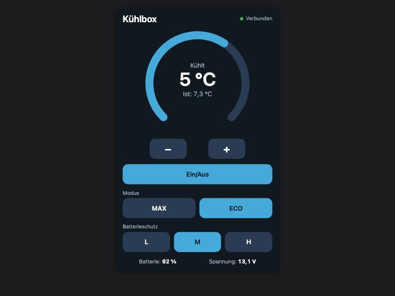

# RV Fridge Card

A Lovelace card for a compressor fridge (caravan, motorhome, boat) that is
exposed to Home Assistant through ESPHome (for example a Tuya-BLE fridge on an
ESP32). It mirrors the fridge page of the Fridolin touch display: a ring with
the target temperature, the actual temperature, an on/off button, mode
(MAX/ECO) and battery protection (L/M/H) - stacked vertically.



## Installation (HACS)

1. HACS -> three dots -> *Custom repositories* -> add this repository with the
   category **Dashboard**.
2. Install **RV Fridge Card**, then reload the browser.

## Configuration

Add the card in the dashboard editor (all entities can be picked in the UI) or
in YAML:

```yaml
type: custom:rv-fridge-card
title: Fridge
entity_power: switch.fridolin_display_kuhlbox_power
entity_target: select.fridolin_display_kuhlbox_zieltemperatur
entity_mode: select.fridolin_display_kuhlbox_modus
entity_battery_protection: select.fridolin_display_kuhlbox_batterieschutz
entity_temp: sensor.fridolin_display_kuhlbox_temperatur
entity_battery: sensor.fridolin_display_kuhlbox_batterie   # optional
entity_voltage: sensor.fridolin_display_kuhlbox_spannung   # optional
```

| Option | Entity type | Expected values |
| --- | --- | --- |
| `entity_power` | `switch` | `on` / `off` |
| `entity_target` | `select` | options `-20 °C` ... `20 °C` (whole degrees) |
| `entity_mode` | `select` | options `MAX` / `ECO` |
| `entity_battery_protection` | `select` | options `L` / `M` / `H` |
| `entity_temp` | `sensor` | actual temperature in °C |
| `entity_battery`, `entity_voltage` | `sensor` | optional, shown in the footer |

The entity IDs above are only an example - use the ones your fridge creates.

## Behaviour

- Tapping `-` / `+` changes the shown target immediately; several quick taps
  are sent as **one** command after a short pause (the fridge is slow to
  answer over Bluetooth).
- *Connected* means the temperature sensor is available and was updated within
  the last five minutes.
- Status text: *Off*, *Ready*, *Cooling* (actual above target) or *No data*.

## Colors

The card uses its own dark blue palette (like the display). Override with
`card-mod` or theme variables: `--rv-fridge-bg`, `--rv-fridge-panel`,
`--rv-fridge-button`, `--rv-fridge-active`, `--rv-fridge-text`,
`--rv-fridge-muted`.

## License

MIT
